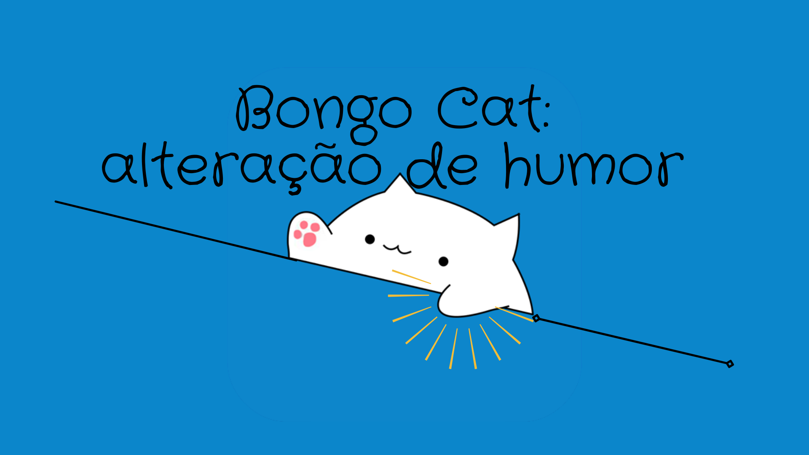

# Bongo-tap-CAt

            
        

exercicio completo com a utilização de Java Script, python, css e a marcação html, com o intuito de demonstrar a alteração de humor atraves de botões (Java), porém utilizei para a movimentação da persona, imitando a aplicação Bongo Cat original.
